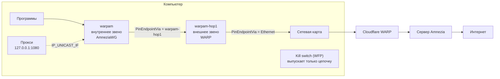

<div align="center">

# WarpAm · AwgChain

**Цепочка WARP + AmneziaWG для Windows, которая работает как один туннель**

Клиент AmneziaWG для Windows с двойным VPN, локальным прокси SOCKS5/HTTP

[](https://github.com/Xbit-Ka/WarpAm/releases)
[](https://github.com/Xbit-Ka/WarpAm/releases)


[Скачать](#установка) · [Возможности](#возможности) · [Как это работает](#как-это-работает) · [Вопросы](#частые-вопросы) · [Сборка](#сборка-из-исходников)

</div>

<!--
  Скриншоты: положите картинки в docs/images/ и раскомментируйте блок.
<p align="center">
  
  
</p>
-->

## Что это

AwgChain основан на официальном [AmneziaWG для Windows](https://github.com/amnezia-vpn/amneziawg-windows-client),
а тот, в свою очередь, на [WireGuard for Windows](https://git.zx2c4.com/wireguard-windows/about/).
Главное отличие: программа умеет собирать **цепочку из двух туннелей**.

```
Ваш компьютер ──► Cloudflare WARP ──► сервер Amnezia ──► интернет
                  (внешнее звено)     (внутреннее звено)
```

- **Провайдер** видит только соединение с Cloudflare.
- **Cloudflare** видит только зашифрованный поток к вашему серверу.
- **Сайты** видят адрес сервера Amnezia.

Цепочка в списке выглядит как один туннель: одна запись, одна кнопка.
Порядок подключения звеньев, маршруты, защита от утечек и восстановление
после обрывов программа делает сама.

Одиночные туннели WireGuard и AmneziaWG тоже работают как обычно.

## Возможности

### 🔗 Цепочка из двух туннелей
- **Мастер из двух шагов:** выбрать конфиг WARP, затем конфиг Amnezia. Получится туннель `warpam`
  (следующие `warpam1`, `warpam2`…), внешнее звено скрыто из списка.
- **Одна кнопка на всё:** при подключении сначала поднимается внешнее звено, программа ждёт его рукопожатия
  и только потом поднимает внутреннее. При отключении порядок обратный.
- **Каждое звено идёт своим путём:** сокет привязан к нужному адаптеру через `IP_UNICAST_IF`, к серверу
  проложен свой маршрут. Цепочка не зацикливается сама в себя, даже когда внутреннее звено забрало
  маршрут по умолчанию.
- **Параметры звеньев** задаются в конфиге строкой `PinEndpointVia = <адаптер>`. Её можно вписать и вручную.
- **Правка как у обычного туннеля:** цепочку можно редактировать, переименовывать и удалять.
  Строки внешнего звена лежат в том же конфиге с префиксом `#!`.
- **Две записи на один аккаунт** (один ключ, один адрес) никогда не поднимаются одновременно.

### 🛡️ Защита от утечек (kill switch)
- **Работает внутри службы:** фильтры Windows (WFP) ставит сама служба AwgChainManager.
  Защита появляется одновременно с туннелем, без отдельного процесса и без «дыр» при старте.
- **При переподключении звеньев** защита не снимается.
- **IPv6.** Если у внутреннего звена есть IPv6-адрес, IPv6 идёт по цепочке так же, как IPv4.
  Если адреса нет, IPv6 блокируется, пока защита включена, чтобы сайты не узнали ваш настоящий адрес по IPv6.
- **Локальная сеть:** принтеры, NAS и роутер остаются доступными, если это разрешить.
- **Кнопки «Снять замок сейчас» и «Поставить замок сейчас»** на вкладке «Настройки».
- **Режимы замка:** обычный работает. Строгий и параноидальный, при которых замок остаётся после
  отключения или стоит уже при загрузке Windows, пока в планах.

### 🌐 Локальный прокси для любого туннеля
- **SOCKS5 и HTTP на одном порту:** SOCKS5 с TCP и UDP, HTTP с `CONNECT` и обычными запросами.
  Протокол определяется по первому байту соединения.
- **Два режима:**
  - **вместе с туннелем:** туннель работает как обычно, а прокси служит дополнительным входом в него;
  - **только через прокси:** туннель не трогает маршруты и системный DNS, адрес компьютера в интернете
    не меняется. Через туннель идут только программы, настроенные на прокси, как при `ssh -D`.
- **Строго через туннель:** каждое соединение привязано к адаптеру туннеля и выйти мимо него не может.
  Имена разрешаются только через DNS туннеля.
- **Если туннель пропал:** можно отвечать ошибкой или закрывать порт. Короткий перезапуск можно пережить,
  не разрывая соединения.
- **Доступ:** только этот компьютер (`127.0.0.1`) или ещё локальная сеть. Для локальной сети логин и пароль
  обязательны, в настройках хранится только хэш пароля.
- **Занятый порт** программа замечает ещё до подключения и сообщает, какой именно.
- **Сторож прокси-туннеля:** если туннель перестал получать ответы от сервера, он перезапускается автоматически.

### ♻️ Самовосстановление и понятный журнал
- **Проверка каждые 5 секунд:** если звено перестало отвечать, цепочка пересобирается,
  а защита остаётся на месте.
- **Журнал объясняет, что случилось:** например, «звено шлёт рукопожатия, а сервер не отвечает».
  Он отличает это от ситуации, когда адаптер пропал или служба упала.
- **Отпечаток параметров:** программа запоминает, с какими ключами и параметрами обфускации сервер уже отвечал.
  Если сервер перестал принимать конфиг, в журнале будет видно, что именно изменилось.
- **Порядок после сбоев:** остатки прошлых запусков (службы и адаптеры без конфигов, туннели, которые падают
  сразу при старте) убираются аккуратно, не задевая рабочие туннели.
- **Окна ошибок:** одинаковые ошибки не открывают десятки одинаковых окон, программа показывает,
  сколько раз ошибка повторилась.
- **Журнал можно очистить** прямо из окна программы.

### 🚀 Автозапуск
- **Служба поднимает туннель при загрузке Windows,** ещё до входа в систему.
- **Что подключать при старте:** ничего, последний использованный или выбранный туннель.
  Если туннель выключили вручную, после перезагрузки он сам не поднимется.
- **Выход из программы** через трей может отключать туннель и снимать защиту.

### 🔐 Конфиги и папка данных
- **Шифрование конфигов** ключом Windows этой машины (DPAPI). Кнопки «Зашифровать» и «Расшифровать» действуют
  на все конфиги, включая скрытые звенья.
- **Строгие права на папку `Data`:** доступ только у системы и администраторов. Их можно открыть группе
  «Пользователи» и вернуть обратно.
- **«Завершить установку и закрыть от изменений»:** одной кнопкой зашифровать всё, поставить строгие права
  и запретить их снимать. Отменить это можно только удалением программы.
- **Портативная копия:** «Подготовить папку к переносу» отключает туннели, удаляет службы и адаптеры,
  открывает права и закрывает программу. После этого папку можно скопировать на флешку.
- **Испорченный `settings.json`** не затирается настройками по умолчанию, а откладывается в сторону.

### 📦 Импорт и экспорт
- **Экспорт в zip** сохраняет цепочку целиком: скрытое звено, настройки и небольшой манифест.
  После импорта всё восстанавливается как было.
- **Архивы WireGuard и Amnezia** без манифеста импортируются по-старому.

## Установка

1. Скачайте установщик для своей системы со страницы [Releases](https://github.com/Xbit-Ka/WarpAm/releases):
   `amd64` для большинства компьютеров, `arm64` для Windows на ARM, `x86` для 32-битной Windows.
2. Установите. Программа ставится в `C:\Program Files\AwgChain`.
3. Подготовьте два конфига:
   - **WARP:** конфиг WireGuard для Cloudflare WARP, например сделанный через
     [wgcf](https://github.com/ViRb3/wgcf) или аналогичную утилиту;
   - **Amnezia:** конфиг AmneziaWG вашего сервера, выгруженный из
     [Amnezia VPN](https://amnezia.org/) в формате AmneziaWG.

> [!NOTE]
> Нужна Windows 10 или 11 и права администратора.

## Быстрый старт

1. **Туннели → Собрать цепочку из двух конфигов (WARP + Amnezia)…**
2. Шаг 1: выберите конфиг WARP. Шаг 2: выберите конфиг Amnezia.
3. В списке появится `warpam`. Нажмите **Подключить**: внешнее звено поднимется само,
   защита от утечек включится автоматически.
4. Проверьте адрес на любом сайте вроде `2ip.ru`: должен быть адрес сервера Amnezia.

**Прокси для отдельных программ.** Выберите туннель, откройте вкладку **Прокси** и включите прокси.
Порт по умолчанию `1080`. Чтобы через туннель ходили только эти программы, выберите режим
**«Только через прокси»**. В браузере укажите `SOCKS5 127.0.0.1:1080`.

## Как это работает



| Компонент | Что делает |
|---|---|
| **AwgChainManager** (служба) | Знает, из каких звеньев состоит цепочка. Поднимает и опускает их по порядку, ставит kill switch, держит прокси, следит за состоянием и восстанавливает цепочку |
| **AwgChainTunnel$&lt;имя&gt;** (служба на каждый туннель) | Поднимает адаптер Wintun, привязывает свой UDP-сокет к нужному адаптеру и прокладывает маршрут к серверу |
| **Окно и значок в трее** | Настройки и состояние. Всё важное делает служба, поэтому окно можно закрыть |
| **amneziawg-go** | Движок протокола AmneziaWG: WireGuard с обфускацией, которую сложнее опознать и заблокировать |

Структура репозитория:

```
amneziawg-go/   движок протокола (userspace, Go)
core/           служба туннеля, конфиги, маршруты, привязка к адаптеру
client/         интерфейс, служба-менеджер, прокси, kill switch, установщик
```

## Частые вопросы

<details>
<summary><b>Зачем нужен WARP перед сервером Amnezia?</b></summary>

Провайдер видит только соединение с Cloudflare, которое выглядит как обычный трафик WARP.
Сервер Amnezia видит адрес Cloudflare, а не ваш. Если прямой доступ к серверу заблокирован,
через WARP он часто всё равно доступен.
</details>

<details>
<summary><b>Можно пользоваться без цепочки?</b></summary>

Да. Обычные конфиги WireGuard и AmneziaWG импортируются и работают как в официальном клиенте.
Прокси и автозапуск доступны и для них.
</details>

<details>
<summary><b>Туннель «подключён», но сайты не открываются</b></summary>

Откройте вкладку **Журнал**. Обычно там уже написано, в чём дело: сервер не отвечает на рукопожатия,
порт прокси занят или у туннеля нет DNS. Если кажется, что программа зависла с включённой защитой,
на вкладке **Настройки** есть кнопка **«Снять замок сейчас»**.
</details>

<details>
<summary><b>Почему после копирования на другой компьютер конфиги не читаются?</b></summary>

Зашифрованные конфиги можно открыть только на той машине, где их зашифровали.
Перед переносом нажмите **«Расшифровать»** или **«Подготовить папку к переносу»**.
</details>

<details>
<summary><b>Можно раздать прокси на другие устройства в локальной сети?</b></summary>

Да, выберите доступ **«Ещё и локальная сеть»**. В этом режиме логин и пароль обязательны.
</details>

## Сборка из исходников

Нужна Windows x64 и Git. Инструменты сборки (Go 1.25, llvm-mingw, WiX, Wintun, ImageMagick)
скрипты скачивают сами и проверяют их по SHA-256.

```bat
git clone https://github.com/Xbit-Ka/WarpAm.git
cd WarpAm\client
build.bat
cd installer
build.bat
```

> [!IMPORTANT]
> В `client/go.mod` директивы `replace` указывают на `C:\dev\vpnchain\amneziawg-windows`
> (это папка `core`) и `C:\dev\vpnchain\amneziawg-go`. Либо положите папки туда,
> либо поменяйте пути на свои.

В репозитории файлы хранятся байт в байт (`.gitattributes`: `* -text`), поэтому исходники с GitHub
совпадают с исходниками автора. При одинаковой версии Go совпадают и собранные `.exe`.
`.msi` при каждой сборке получает новый код продукта, поэтому его контрольная сумма всегда разная.

## Благодарности

- [WireGuard for Windows](https://git.zx2c4.com/wireguard-windows/about/): Jason A. Donenfeld и WireGuard LLC
- [AmneziaWG](https://github.com/amnezia-vpn): команда Amnezia VPN
- [Wintun](https://www.wintun.net/)
- [Cloudflare WARP](https://one.one.one.one/)

## Лицензия

MIT, как у исходных проектов. Тексты лицензий лежат в [`client/COPYING`](client/COPYING)
и [`amneziawg-go/LICENSE`](amneziawg-go/LICENSE).

WireGuard является зарегистрированным товарным знаком Jason A. Donenfeld. Проект не связан
с WireGuard LLC, Amnezia VPN и Cloudflare и не одобрен ими.
